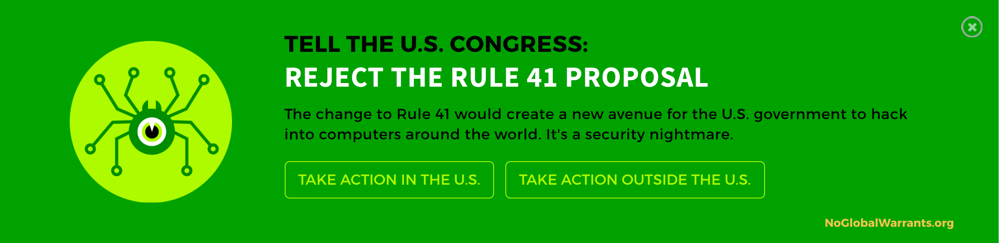

# Net Neutrality "Day of Action" Banner

_Please feel free to make pull requests with any fixes, and leave suggestions and bugs on our [issue](https://github.com/EFForg/net-neutrality-doa/issues) page._

net-neutrality-doa is a javascript snippet that automatically activates at midnight of July 12 and adds a banner to your site for 24 hours in support of the net neutrality [Day of Action](https://www.eff.org/deeplinks/2017/06/eff-and-broad-coalition-call-day-action-defend-net-neutrality).

**If you own a website, no matter how big or small, you can be part of this.**

<a href="https://efforg.github.io/net-neutrality-doa/example/banner.html" target="_blank"></a>

## Demo page

<a href="https://efforg.github.io/net-neutrality-doa/example/banner.html">This page</a> shows what the banner will look like on the day of action. 

*Note: Please don't copy the code from the source files of the demo pages. Use the code below instead.* 

## Getting started

You can add the snippet to your site now - it won't be activated until midnight (user's system time) on June 21st and will remain active for that day only.

_Place the code below before `</body>` tag. The script loads asynchronously and won't affect page load times._

```html
<!--[if !(lt IE 8)]><!-->
<script type="text/javascript">
  (function(){
    var e = document.createElement('script'); e.type='text/javascript'; e.async = true;
    e.src = 'https://www.eff.org/doa/widget.min.js';
    var s = document.getElementsByTagName('script')[0]; s.parentNode.insertBefore(e, s);
  })();
</script>
<!--<![endif]-->
```

The widget supports all screen sizes and platforms, if you encounter a bug please let us know on the [issues](https://github.com/EFForg/net-neutrality-doa/issues) page.

## Configuration

You can configure the banner using a javascript object:

```html
<!--[if !(lt IE 8)]><!-->
<script type="text/javascript"> 
  // The defaults are set below
  var banner_config = {
    disableDate: false, // If true, the banner shows even if the date is not yet 06/21/2016. Use for testing.
    debug: false // Reveals any errors and debug messages. For debugging purposes only.
  };
  (function(){
    var e = document.createElement('script'); e.type='text/javascript'; e.async = true;
    e.src = 'https://www.eff.org/doa/widget.min.js';
    var s = document.getElementsByTagName('script')[0]; s.parentNode.insertBefore(e, s);
  })();
</script>
<!--<![endif]-->
```
